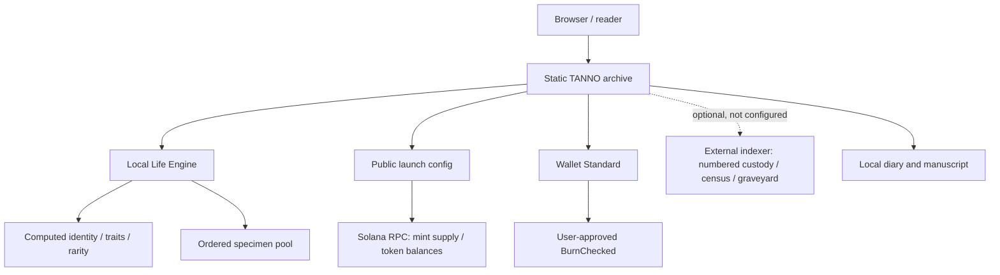

# TANNO

One billion computed lives. Built for Solana.

TANNO is a deterministic digital-life archive. A life is computed from an integer identity: the same number resolves to the same traits, rarity, pixels and—while the ordered specimen pool is fixed—the same specimen image. The token may be fungible. The life is computed.


**Status:** PRE-LAUNCH · **Mint:** TBA · **License:** not yet selected. No mainnet mint, audit, live indexer or numbered custody claim is made here.

## The idea

There are 1,000,000,000 possible Life IDs. The identity function is local and recomputable; generating an identity does not require minting an NFT or calling a server. The archive gives those records a narrative form. A future, explicitly specified mapping could associate fungible token custody with numbered lives, and verified burns could support mortality records. That mapping and indexer are not active in this repository.

## Deterministic identity

```text
integer Life ID
    ↓ validate 1…1,000,000,000
seed → deterministic PRNG → traits + rarity + pixels
    ↓
fixed ordered specimen pool → image index
    ↓
versioned life record
```

The core implementation is [`assets/js/engine.js`](assets/js/engine.js) and [`lib/life-engine.cjs`](lib/life-engine.cjs). The website's CORE CODE view is built from these actual source files. Version 1 outputs are regression-tested. A fixed ID is not re-rolled when the page reloads or another browser opens it.

```js
const { lifeEngine } = require('./lib/life-engine.cjs');
const life = lifeEngine(777);
console.log(life.name, life.species, life.rarity, life.engineVersion);
// TANNO #000000777 Bebi MYTHIC 1
```

The return value also includes palette, eyes, body, temperament, trait, lifespan class, and optional specimen image index/source. The image is selected only when an ordered image pool is passed. See [Life Engine](docs/life-engine.md) and [compatibility policy](docs/compatibility.md).

## Architecture



There is no backend or database in this repository. The browser can compute identity without Solana; chain reads and wallet actions require a valid launch configuration. An optional indexer is a separate trust boundary, not an existing service.

## Current status

| Layer | State |
| --- | --- |
| Static archive, local identity engine, specimen mapping | Implemented |
| Solana network configuration | Public RPC configured; mint empty |
| Token mint / CA | TBA — PRE-LAUNCH |
| Wallet connection and BurnChecked client code | Implemented in source; production burn inactive until a real mint is configured |
| Numbered ownership, Village, Census activity, Graveyard | Sample/presentational or indexer-required; not verified live records |
| Smart contract, audit, mainnet token deployment | Not claimed |

See [identity model](docs/identity-model.md), [Solana boundary](docs/solana.md), and [data model](docs/data-model.md) before interpreting a token balance as a numbered life.

## Repository map

| Path | Purpose |
| --- | --- |
| `index.html`, `assets/css/`, `assets/js/` | Archive document, styling, browser behavior and original generator |
| `lib/life-engine.cjs` | Validated, versioned identity record |
| `lib/config.cjs`, `lib/rpc.js`, `lib/wallet.js` | Public config validation, chain reads and wallet discovery |
| `config/project.json` | Browser-visible PRE-LAUNCH configuration |
| `data/` | Trusted editorial and static archive data |
| `assets/images/sevra/gallery/` | Current ordered specimen-image pool |
| `scripts/build.cjs` | Static build, image manifest and source-backed Core Code |
| `tests/` | Node unit and Playwright browser checks |
| `docs/` | Architecture and model documentation |

The existing project layout is kept so the production build remains reproducible; there is no cosmetic `src/` migration.

## Local development

Node.js 20+:

```sh
npm ci
npm run lint
npm test
npm run build
npm run preview
```

Open `http://127.0.0.1:4190/`. With that preview running, execute browser tests with `npx playwright test tests --workers=1` (install Playwright Chromium first if needed). `npm run build` writes deployable static files to `dist/`. Vercel uses this real build command and publishes `dist/`; see [deployment](docs/deployment.md). Do not commit `dist/`, `node_modules/`, `.vercel/`, secrets, or local debug output.

## Reading further

- [Architecture](docs/architecture.md) · [Life Engine](docs/life-engine.md) · [Specimen System](docs/specimen-system.md)
- [Identity Model](docs/identity-model.md) · [Data Model](docs/data-model.md) · [Compatibility](docs/compatibility.md)
- [Solana](docs/solana.md) · [Mortality](docs/mortality.md) · [Village](docs/village.md) · [Census](docs/census.md)
- [Security](SECURITY.md) · [Contributing](CONTRIBUTING.md) · [Changelog](CHANGELOG.md)

Website: [tanno.live](https://tanno.live/) · X: [@tanno_token](https://x.com/tanno_token) · GitHub: [theovarne/tanno](https://github.com/theovarne/tanno) · Mint: TBA

No license has been granted in this repository yet. Do not assume that public visibility permits reuse of source or artwork.