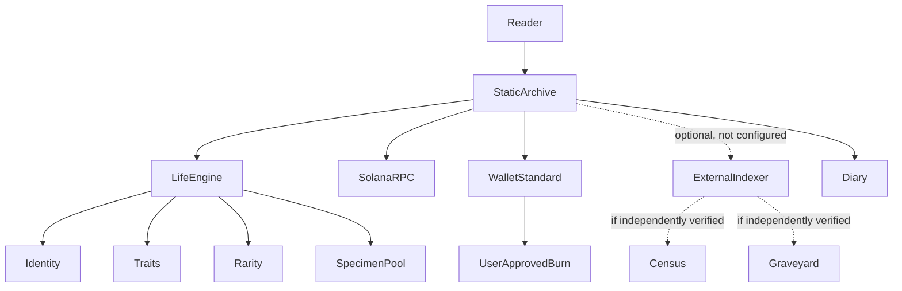

# Architecture

TANNO is a static archive compiled by `scripts/build.cjs` into `dist/`. Vercel serves the generated files; no server process or database is part of this repository.

`index.html` supplies the long-form manuscript. `assets/js/archive.js` powers document interactions, `assets/js/app.js` powers the live-life UI, `assets/js/burn.js` constructs a user-signed burn, and `assets/js/engine.js` is the original deterministic portrait generator. `lib/life-engine.cjs` turns an integer ID into a frozen identity record. `lib/rpc.js` and `lib/wallet.js` isolate browser RPC and Wallet Standard access. `config/project.json` is public launch configuration, not a secret store. `data/diary.json` is trusted editorial content.

The build renders the diary, discovers and sorts local specimen images, generates a Core Code view from real source files, bundles browser modules, and copies static assets into `dist/`. The resulting page works as a static site; connected wallet and on-chain readings require browser access to the configured Solana endpoint. Optional indexed endpoints are separate infrastructure and are not implemented here.

Identity computation is local. Token balances come from chain RPC. Numbered custody and death records can only come from a separately specified, auditable assignment/indexing process; they are not inferred from a fungible token balance.

## Runtime map

The dashed indexer edge is deliberately optional: the repository has only its client contract, not an indexer implementation.